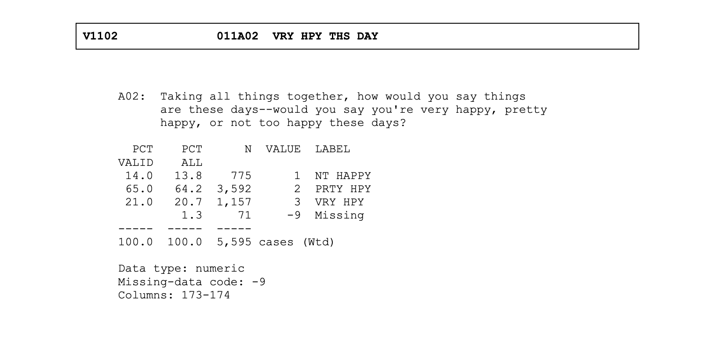
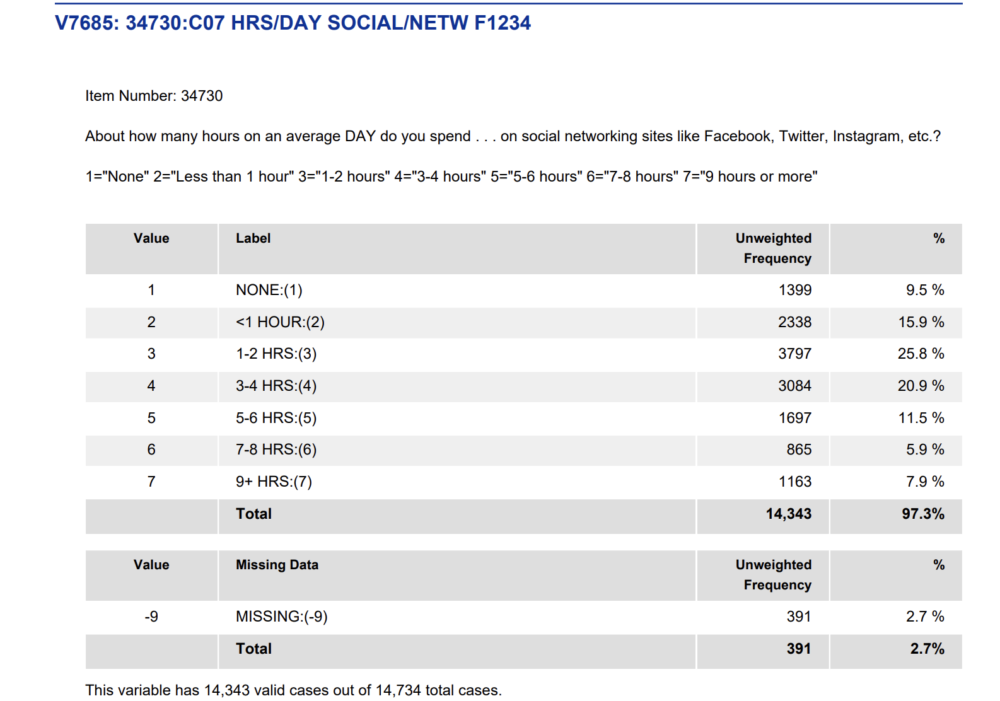



```{r}
#| echo: false
#| message: false
#| warning: false
library(tidyverse)
library(ggthemes)
library(NHANES)
library(modelr)
load("data/mtf.RData")
theme_set(theme_tufte())
```

```{webr}
#| echo: false
#| message: false
#| warning: false
#| autorun: true
library(tidyverse)
library(ggthemes)
library(NHANES)
library(modelr)
load("data/mtf.RData")
theme_set(theme_tufte())
```

```{webr}
NHANES |> lm(as.integer(Depressed) ~ HHIncomeMid, data=_) |> summary()
```

## Wealthier people sleep more

```{webr}
NHANES |> lm(SleepHrsNight ~ HHIncomeMid, data=_) |> summary()
```

## Wealthier people are in better shape

```{webr}
NHANES |> lm(BMI ~ HHIncomeMid, data=_) |> summary()
```

## Wealthier people are less likely to smoke

```{webr}
NHANES |> mutate(smoke = Smoke100 == "Yes") |> lm(smoke ~ HHIncomeMid, data=_) |> summary()
```

## The challenge of proving that wealth causes happiness

-   When I condition on the wealth level, I'm also conditioning on all the other factors that are also correlated with wealth.
-   It's impossible to isolate the effect of wealth on happiness from observational data.
-   The extra factors that are correlated with both wealth and happiness are called **confounders**.

## Famous example of confounding

In the 1970s UC Berkeley was sued for gender bias in admissions to its graduate programs.

```{webr}
ucb1
```

## Omitted variable bias

-   The overall data shows a bias against women.
-   But: there is another variable lurking in the background: the choice of department.
-   Some departments are more competitive than others.
-   Women tend to apply to more competitive departments.

## 

```{webr}
UCBAdmissions |> apply(3, prop.test)
```

## Simpson's paradox

(When the trend appears in several different groups of data but disappears or reverses when these groups are combined.)

```{r}
ucbt <- UCBAdmissions |> as_tibble() |> pivot_wider(names_from=Admit, values_from=n)
ucbt |> group_by(Gender) |> summarize(Admitted = sum(Admitted), Rejected = sum(Rejected)) |>
  mutate(Dept = "Overall") |> bind_rows(ucbt) |>
  mutate(admit_rate = Admitted / (Admitted + Rejected)) |>
  ggplot() + geom_line(aes(x=Gender, y=admit_rate, group=Dept, color=Dept))
```

# Spurious correlations

[](https://www.tylervigen.com/spurious/correlation/5920_per-capita-consumption-of-margarine_correlates-with_the-divorce-rate-in-maine)

## My favorite

-   `a2.income`: Median HH income in Ann Arbor
-   `para.pop`: Population of Paraguay

```{webr}
load('data/a2pp.RData')
a2i.pp
```

# ~~Causes~~ Correlates of teen/pre-teen depression

## Monitoring the Future

-   [Annual survey of 8th, 10th, and 12th graders in the US](https://monitoringthefuture.org/)
-   Since 1975; large, nationally representative samples
-   Researchers are right here at UM!

## Measuring happiness



## Measuring other behaviors



## Results from past 30 years

```{webr}
mtf_happiness
```

## What's causing the decline

-   Social media?
-   Economic uncertainty?
-   Academic pressure?
-   Increased focus on mental health?

## Online and in-person activities

Starting in about 2012, MTF started asking detailed questions about online and real life activities.

```{webr}
mtf_activities
```

## Computing correlations

Objective: compute the correlation between different activities, and happiness

```{webr}
# mtf_activities |> ...
```

## Thought experiment

```{webr}
cor(as.integer(mtf_activities$V7685), as.integer(mtf_activities$V7302), use="complete.obs")
```

-   Time spent on social media is correlated with lower happiness:
-   Why doesn't this imply that social media **causes** lower happiness?

## Problem with just looking at correlations

-   Confounding/omitted variables
-   Reverse causation

## Controlling for confounders
- We can use regression to control for confounders.
- This works **if** we have measured all the relevant confounders. 
  - Very unlikely in practice. Almost never true.
  - But we can try to measure some of the most important ones.
- (What about reverse causation?)

## RCT
- The gold standard for establishing causation is a randomized controlled trial (RCT).
- Example: randomly assign some teens to not use social media for a week, and others to use it as normal.
- Why is this **better** than observational data?
- Why is this **harder** than observational data?

## Regressing out SES, gender, race, grade
```{webr}
mdl <- lm(as.integer(V7302) ~ V1070 + V7202 + V7215 + V7216, data = mtf_activities, weights = V5)
summary(mdl)
```

## Residuals
- The residuals are what is left after we control for the confounders.
- We can look at the correlation between the residuals of happiness and social media use.
- This is called the **partial correlation**: the correlation between two variables after controlling for other variables.

## Partial correlation between social media and happiness
```{r}
mdl <- lm(as.integer(V7302) ~ V1070 + V7202 + V7215 + V7216, data = mtf_activities, weights = V5)
mtf_activities |> 
  add_residuals(mdl) |> 
  select(V7685, resid) |> 
  na.omit() |> 
  ggplot() + 
  geom_boxplot(aes(x = V7685, y = resid))
```

## Numerically
Objective: compute the partial correlation between social media use and happiness
```{webr}
# mtf_activities |> ...
```

## Partial correlation between happiness and many other factors
Objective: compute the partial correlation between happiness and everything on this list:
```{webr}
mtf_codes
```

## `for` loops
Many repetitive tasks => use a loop.

```{webr}
for (code in mtf_codes[9:28]) {
  print(code)
}
```
## Computing partial correlations
Objective: use a for loop to compute the partial correlation between happiness and each of the activities in `mtf_codes[9:28]`.
```{webr}
results <- c()
mtfr <- mtf_activities |>  add_residuals(mdl)
for (code in names(mtf_codes)[9:28]) {
  pc <- cor(as.integer(mtfr[[code]]), mtfr$resid, use="complete.obs")
  results <- append(results, pc)
}
```

## Results
```{webr}
df <- tibble(activity = mtf_codes[9:28], partial_correlation = results)
df |> arrange(desc(abs(partial_correlation))) |> 
  ggplot() + 
  geom_col(aes(x = activity, y = partial_correlation)) 
```

