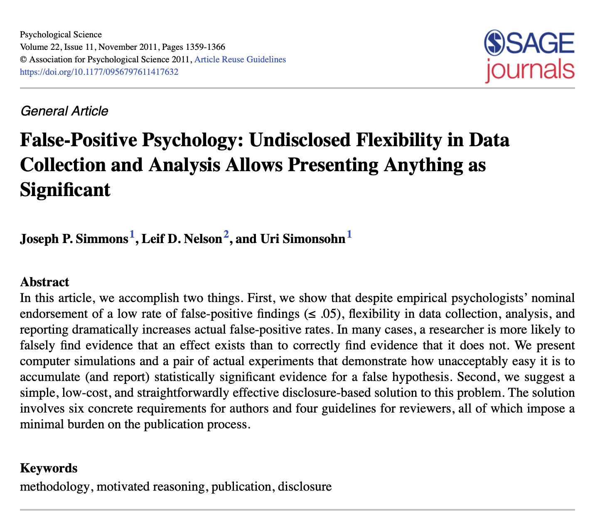

# Reproducibility, replicability, p-hacking, and all that



```{webr}
#| echo: false
#| message: false
#| warning: false
#| autorun: true
library(tidyverse)
load("data/surveys.RData")
```

```{r}
#| echo: false
#| message: false
#| warning: false
library(tidyverse)
load("data/surveys.RData")
```

# Headline news

In a recent study, researchers found that having a UMID ending in 8 **causes** students to be 9.7 cm shorter on average. The study analyzed data from 102 students and reported a p-value of 0.02, and controlled for gender and ancestry.

## Recall `survey2`

```{webr}
survey2_final
```

## Replicating the analysis

```{webr}
lm(height_cm ~ I(umid == 8) + sex + continent, data = survey2_final) |> summary() |> coef()
```

## Why is this causal?

-   Recall what it means to establish causality.
-   What design features are present here that support a causal interpretation?
-   Are there any potential confounders?

## What I actually did

```{webr}
# complete in class
```

## What I should have done

-   Declare in advance what analysis I was going to do
-   Correct for multiple comparisons
-   Report *all* analyses I tried, not just the significant one

## Multiple testing

-   When we do many statistical tests, some will be significant just by chance.
-   [Bonferroni correction](https://en.wikipedia.org/wiki/Bonferroni_correction): divide the significance level by the number of tests.
-   So if we perform 10 tests, use $\alpha=.005$ instead of $\alpha=.05$.

## What this example shows

-   This is an example of **p-hacking**
-   By trying many different analyses, we can find something statistically significant even if there is no real effect.
-   This means that the type-I error rate (false positive rate) is much higher than the nominal 5%.

## Why this matters

This is a big problem in scientific research, and has led to a "replication crisis" in many fields:

-   [Psychology](https://en.wikipedia.org/wiki/Replication_crisis)
-   [Economics](https://theconversation.com/the-replication-crisis-has-engulfed-economics-49202)
-   [Biology](https://www.nature.com/articles/483531a)

# Researcher degrees of freedom

[](https://journals.sagepub.com/doi/10.1177/0956797611417632)

## What they found

> we asked 20 University of Pennsylvania undergraduates to listen to either “When I’m Sixty-Four” by The Beatles or “Kalimba.” Then, in an ostensibly unrelated task, they indicated their birth date (mm/dd/yyyy) and their father’s age. We used father’s age to control for variation in baseline age across participants. An ANCOVA revealed the predicted effect: According to their birth dates, people were nearly a year-and-a-half younger after listening to “When I’m Sixty-Four” (adjusted M = 20.1 years) rather than to “Kalimba” (adjusted M = 21.5 years), F(1, 17) = 4.92, p = .040.

## What they actually did

> **Using the same method as in Study 1, we asked ~~20~~** 34 **University of Pennsylvania undergraduates to listen** only **to either “When I’m Sixty-Four” by The Beatles or “Kalimba”** or “Hot Potato” by the Wiggles. We conducted our analyses after every session of approximately 10 participants; we did not decide in advance when to terminate data collection. **Then, in an ostensibly unrelated task, they indicated** only **their birth date (mm/dd/yyyy) and** how old they felt, how much they would enjoy eating at a diner, the square root of 100, their agreement with “computers are complicated machines,” **their father’s age**, their mother’s age, whether they would take advantage of an early-bird special, their political orientation, which of four Canadian quarterbacks they believed won an award, how often they refer to the past as “the good old days,” and their gender. **We used father’s age to control for variation in baseline age across participants**.

## Examples of researcher degrees of freedom:

-   Analyzing two variables but only reporting one.
-   Deciding when to stop data collection based on interim results.
-   Collecting more data after seeing initial results.
-   Trying different statistical models and only reporting the one that gives significant results.

## Example: analyzing two variables

-   We collect 100 observations of X1, X2, and Y, all independent Normal(0,1).
-   We want to test if either X1 or X2 is associated with Y.
-   (For example, "Y" is "height", "X1" is "having UMID ending in 8", and "X2" is "having UMID ending in 9".)
-   We only report the result for the variable that gives a significant p-value.
-   What is the actual type-I error?

## 

```{webr}
sig <- 0
for (i in 1:1000) {
  X1 <- rnorm(n=100)
  X2 <- rnorm(n=100)
  Y <- rnorm(n=100)
  sig  <- sig + (min(cor.test(X1, Y)$p.value, cor.test(X2, Y)$p.value) < 0.05)
}
sig / 1000
```

## Example: collecting more data

-   Collect 20 samples. Test if X and Y are associated.
-   If p-value \< 0.05, stop and report result.
-   Otherwise, collect 10 more samples and repeat.
-   What is the actual type-I error?

## 

```{webr}
sig <- 0
for (i in 1:1000) {
  X <- rnorm(n=30)  
  Y <- rnorm(n=30)
  sig <- sig + (cor.test(X[1:20], Y[1:20])$p.value < 0.05 ||
                cor.test(X, Y)$p.value < 0.05)
  
}
sig / 1000
```

# Are most published research findings false?

[{fig-align="center"}](https://journals.plos.org/plosmedicine/article?id=10.1371/journal.pmed.0020124)

## Examples of practices that could affect replicability

-   Researcher bias (see above)
-   Multiple teams working independently on the same problem
-   Winner's curse

## Researcher bias

-   Researchers may have a vested interest in finding a particular result.
-   This can lead to conscious or unconscious bias in data collection, analysis, and interpretation.
-   For example, a pharmaceutical company may be more likely to publish positive results about their drug

## Publication bias
-  Journals are more likely to publish studies with significant results.
-  This leads to a biased literature, where null results are underrepresented.
-  Meta-analyses based on published literature may overestimate true effect sizes.

## Simulating publication bias
-   Let's simulate a scenario where several teams are working independently to test the same hypothesis.
-   Each team conducts a study with no true effect (null hypothesis is true).
-   Only studies with significant results are published.
-   What is the actual type-I error?

##
```{webr}
set.seed(123)
n_teams <- 10
sig <- 0
for (i in 1:1000) {
  results <- rnorm(n=n_teams, mean = 0, sd = 1)
  p_values <- 2 * (1 - pnorm(abs(results)))
  sig <- sig + any(p_values < 0.05)
}
sig / 1000  
```

## Correcting for this
- We could correct for this using Bonferroni:
- The trouble is that we don't know how many teams there are!

## The winner's curse
-   Even when research is correctly carried out, there is a problem known as the "winner's curse".
-   Studies that find statistically significant results are more likely to be published.
-   These studies are more likely to overestimate the true effect size.
-   This leads to a biased literature, where published studies are not representative of the true effects.

## Simulating the winner's curse

-   Let's simulate a scenario where the true effect size is zero, but we conduct many studies and only publish those that find significant results.
-   What does the distribution of effect sizes looks like among the published studies?

## 

```{webr}
set.seed(123)
n_studies <- 1000
true_effect <- 0.5
study_results <- tibble(
  study_id = 1:n_studies,
  estimated_effect = rnorm(n_studies, mean = true_effect, sd = 1),
  p_value = 2 * (1 - pnorm(abs(estimated_effect)))
)
published_studies <- study_results |> filter(p_value < 0.05)
```

## Distribution of estimated effects in published studies

```{webr}
ggplot(published_studies, aes(x = abs(estimated_effect))) +
  geom_histogram(binwidth = 0.1, fill = "blue", alpha = 0.7) + 
  geom_vline(xintercept = true_effect, color = "red", linetype = "dashed")
```
