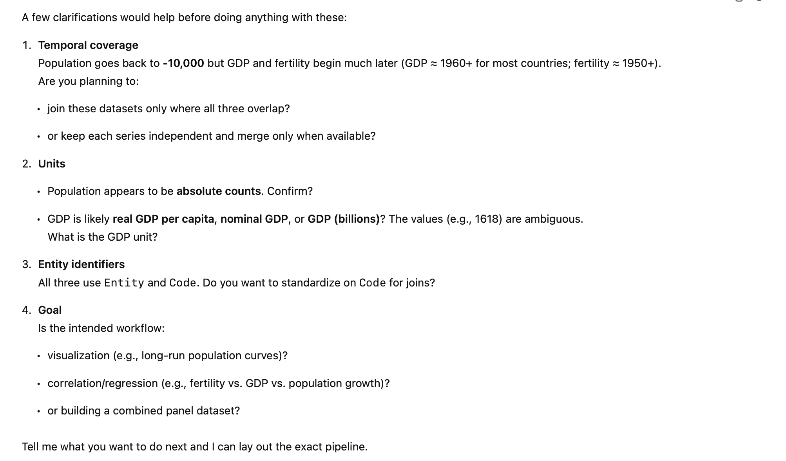



```{webr}
#| echo: false
#| message: false
#| warning: false
#| autorun: true
library(tidyverse)
library(gapminder)
theme_set(theme_minimal())
load("data/population.RData")
```

```{r}
#| echo: false
#| message: false
#| warning: false
library(tidyverse)
library(gapminder)
theme_set(theme_minimal())
load("data/population.RData")
```

# Population growth

{fig-align="center"}

## Overpopulation scare

-   In the 1960s and 1970s, there was widespread concern that the world's population was growing too quickly.
-   Books like *The Population Bomb* by Paul Ehrlich warned of mass starvation and societal collapse due to overpopulation.
-   Governments and organizations considered various measures to control population growth, including family planning programs and incentives for smaller families.

## Population growth models

-   These dire predictions were based in part on the assumption that human population growth follows an exponential model.
-   Exponential growth occurs when the growth rate of a population is proportional to its current size, leading to rapid increases over time.
-   The mathematical model for exponential growth is given by the equation:

## Modeling population growth

-   Say each person has 2 kids.

-   Each generation doubles the population:

    $$ P_t = 2 \times  P_{t-1} = 2 \times 2 \times P_{t-2} = \cdots = 2^t \times P_0$$

-   More generally, if each person has \$ k \$ kids, then:

    $$ P_t = k \times \cdots \times k \times P_0 = P_0 \times \cdot k^t  = P_0 \times e^{t \log k}$$

-   $r = \log k$ is called the growth rate.

## Exponential growth model

$$
P(t) = P_0 e^{rt}
$$ where:

-   $P(t)$ is the population at time $t$,
-   $P_0$ is the initial population,
-   $r$ is the growth rate,
-   $e$ is Euler's number (approximately 2.71828).

## Human population data

-   Historical estimates of world population have been compiled from various sources, including census data, archaeological findings, and historical records.
-   Modern data is collected by Gapminder and UN.
-   Forecasts also available from UN and other sources.
-   These have been synthesized into a dataset from [OWID dataset](https://ourworldindata.org/grapher/population)

## 

```{webr}
population
```

## World populations up to 1970s

```{webr}
# Plot population over time %in% c("Asia", "Africa", "Europe", "North America")
```

## Log-scaling

-   Exponential growth looks linear on a log scale:

    $$\log P(t) = \log P_0 + rt$$

-   So if we plot $\log P(t)$ vs $t$ and exponential growth is occuring, we should see a straight line with slope $r$.

## 

```{webr}
# plot on log scale
```

## Estimating the growth rate using regression

```{webr}
# regression estimate of growth rate
```

## Population forecasting

-   Using the estimated growth rates from the regression, we can forecast future population growth.
-   (What is this assuming?)

## 

```{webr}
# predicted growth
```

## Predictions vs. reality

```{webr}
# plot predictions as well as data
```

## Residuals from exponential model

```{webr}
# plot residuals over time
```

## What caused population slowdown?

-   Family planning: Increased access to contraception and family planning services allowed people to have fewer children.
-   Economic development: As countries developed economically, birth rates tended to decline.
-   Education: Higher levels of education

## Fertility rates versus wealth

```{webr}
fertility
```

## 

```{webr}
gdp
```

## 

```{webr}
# plot fertility vs per-capita gdp for various countries
```

# Interactive data explorer

## Initiating the chat


## Ask for help



## Clarify design choices


## Resulting app

[https://gqg8ee-jonathan-terhorst.shinyapps.io/popgrowth/](https://gqg8ee-jonathan-terhorst.shinyapps.io/popgrowth/)

